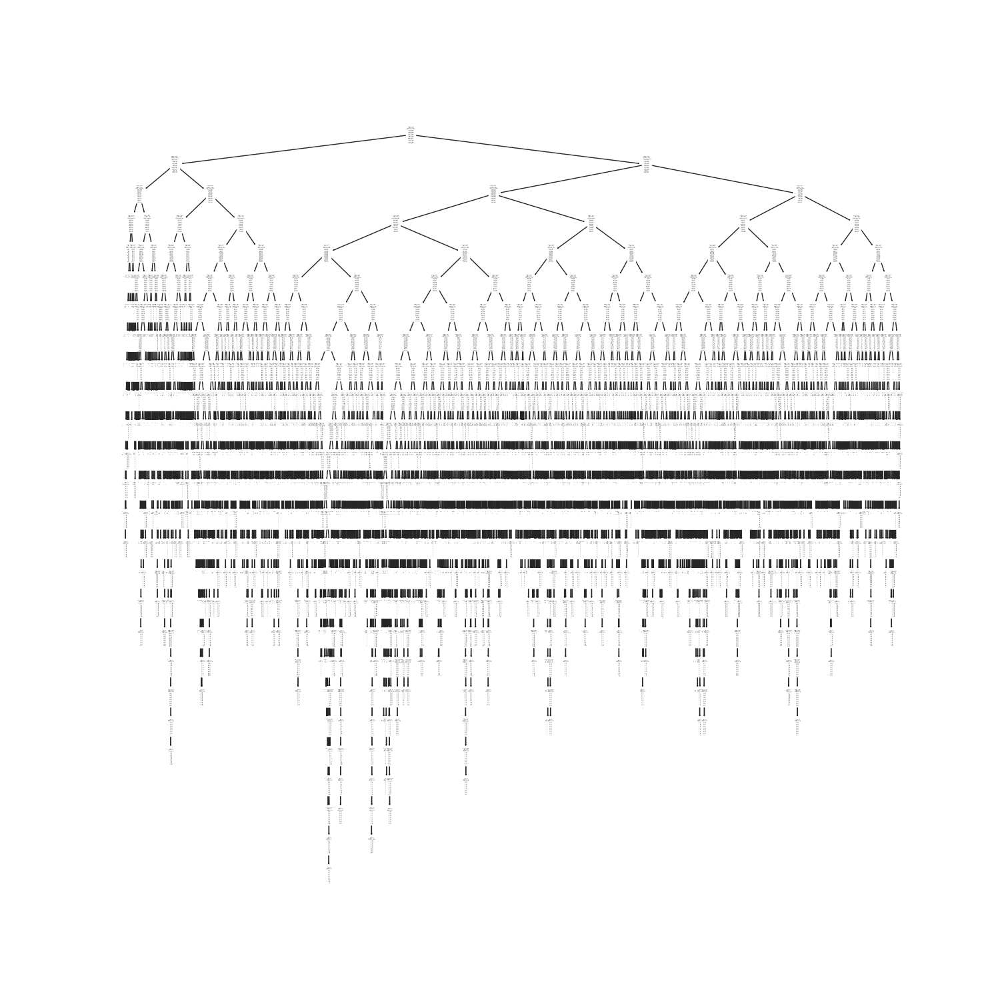
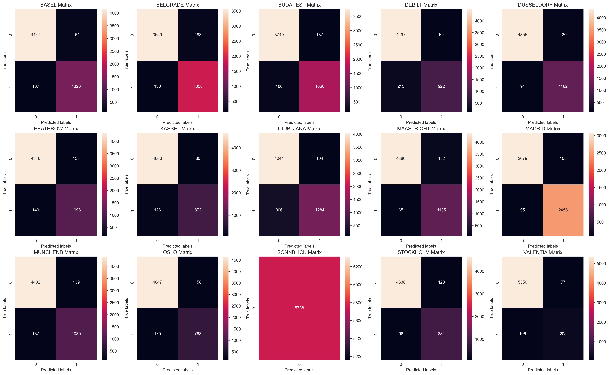

# Predicting Climate Change Using Machine Learning at ClimateWins

Climate Wins is interested in using machine learning to help predict the consequences of climate change around Europe and, potentially, the world. It’s been sorting through hurricane predictions from <a href='https://www.noaa.gov/'>The National Oceanic and Atmospheric Administration (NOAA)</a> in the U.S., typhoon data from <a href='https://www.jma.go.jp/jma/indexe.html'>The Japan Meteorological Agency (JMA)</a> in Japan, world temperatures, and a great deal of other data. However, it’s hard to grasp how everything is changing in the world at once. This is where machine learning comes in!

### Getting Started

For this project, we are interested in identifying the best resources for predicting climate changes where people live. We have chosen to use both supervised and unsupervised machine learning algorithms.

### Models

We have chosen one supervised learning model and two unsupervised models:
<ul><li>K-Nearest Neighbour (KNN)</li><li>Decision Tree</li><li>Artificial Neural Network</li></ul>

### Data

<ul><li>The data is obtained from the <a href='https://www.ecad.eu/'>European Climate Assessment & Data Set project</a></li>
<li>The <a href='https://s3.amazonaws.com/coach-courses-us/public/courses/da-spec-ml/Scripts/A1/Dataset-weather-prediction-dataset-processed.csv'>dataset</a> consists of weather observations from 18 European weather stations from the late 1800s to 2022.</li>
<li>Recordings exist for almost every day with values such as temperature, wind speed, snow, global radiation, and more.</li></ul>

### Using ML in Weather Data

Machine learning (ML) algorithms are a set of techniques that allow computers to learn from data and make predictions or decisions without being explicitly programmed for a specific task. ML can be highly beneficial for analysing and predicting weather patterns. This can include forecasting temperatures, humidity, wind speed, rainfall etc. They can also be used to detect unusual events or patterns such as heatwaves or unseasonal rains.
For this project, we are using three ML algorithms:                                                                                                            
<ul><li><i>k-Nearest Neighbour (KNN)</i> - is a simple, versatile, and widely-used machine learning algorithm used for both classification and regression tasks. It is a supervised learning algorithm, meaning it relies on labelled training data to learn and make predictions.</li>
<li><i>Decision Tree</i> - also used for classification and regression tasks. It works by splitting the data into subsets based on the value of input features, making it highly interpretable and effective for a range of practical applications.</li>
<li><i>Artificial Neural Network</i> - is used for a wide range of machine learning tasks, including classification, regression, and many more complex problems like image recognition, natural language processing, and time-series forecasting.</li></ul>

### Ethical Considerations
To address ethical concerns, we have to consider any bias that may impact how the analysis is conducted and the results thereof. Bias in machine learning can affect model performance, accuracy, fairness, and overall generalisability.

Some biases observed in this project include:
<ol><li><b>Collection Bias:</b> The data was collected from 18 weather stations. However, according to the ECAD there are a total of 23755 weather stations across Europe. This sample of weather stations may not be a representative sample</li>
<li><b>Temporal Bias:</b> Given that the data range is so large (1800s to 2022), some of the data is likely to not be relevant anymore and could result in a distorted outcome from the models</li>
<li><b>Location Bias:</b> The data has been collected from only European weather stations and may not be able to predict weather patterns from other areas of the world given that climates are different.</li></ol>

### Models
#### K-Nearest Neighbour
We ran the data through a KNN model, which yielded an overall accuracy score of 88,15% for all 15 weather stations. Valentia has the best accuracy score of 95.83%, well above the mean of 88%. Sonnblick showed an accuracy score of 100%, indicating that the model was overfitting. i.e. the model has overadapted to the training data and captures even random fluctuations. 
<table>
        <tr>
            <th>Station</th>
            <th>Predicted Negative</th>
            <th>Predicted Positive</th>
            <th>Actual Negative</th>
            <th>Actual Positive</th>
            <th>Accuracy</th>
        </tr>
        <tr>
            <td>BASEL</td>
            <td>3907</td>
            <td>935</td>
            <td>465</td>
            <td>431</td>
            <td>84.38%</td>
        </tr>
        <tr>
            <td>BELGRADE</td>
            <td>3238</td>
            <td>1502</td>
            <td>460</td>
            <td>538</td>
            <td>82.61%</td>
        </tr>
        <tr>
            <td>BUDAPEST</td>
            <td>3416</td>
            <td>1432</td>
            <td>406</td>
            <td>484</td>
            <td>84.49%</td>
        </tr>
        <tr>
            <td>DEBILT</td>
            <td>4346</td>
            <td>732</td>
            <td>369</td>
            <td>291</td>
            <td>88.50%</td>
        </tr>
        <tr>
            <td>DUSSELDORF</td>
            <td>4167</td>
            <td>800</td>
            <td>431</td>
            <td>340</td>
            <td>86.56%</td>
        </tr>
        <tr>
            <td>HEATHROW</td>
            <td>4161</td>
            <td>754</td>
            <td>414</td>
            <td>409</td>
            <td>85.66%</td>
        </tr>
        <tr>
            <td>KASSEL</td>
            <td>4563</td>
            <td>607</td>
            <td>316</td>
            <td>252</td>
            <td>90.10%</td>
        </tr>
        <tr>
            <td>LJUBLJANA</td>
            <td>3726</td>
            <td>1133</td>
            <td>410</td>
            <td>469</td>
            <td>84.68%</td>
        </tr>
        <tr>
            <td>MAASTRICHT</td>
            <td>4249</td>
            <td>819</td>
            <td>357</td>
            <td>313</td>
            <td>88.32%</td>
        </tr>
        <tr>
            <td>MADRID</td>
            <td>2735</td>
            <td>2257</td>
            <td>313</td>
            <td>433</td>
            <td>87.00%</td>
        </tr>
        <tr>
            <td>MUNCHEN</td>
            <td>4222</td>
            <td>766</td>
            <td>426</td>
            <td>324</td>
            <td>86.93%</td>
        </tr>
        <tr>
            <td>OSLO</td>
            <td>4624</td>
            <td>507</td>
            <td>352</td>
            <td>255</td>
            <td>89.42%</td>
        </tr>
        <tr>
            <td>SONNBLICK</td>
            <td>5738</td>
            <td>0</td>
            <td>0</td>
            <td>0</td>
            <td>100.00%</td>
        </tr>
        <tr>
            <td>STOCKHOLM</td>
            <td>4449</td>
            <td>588</td>
            <td>384</td>
            <td>317</td>
            <td>87.78%</td>
        </tr>
        <tr>
            <td>VALENTIA</td>
            <td>5391</td>
            <td>108</td>
            <td>168</td>
            <td>71</td>
            <td>95.83%</td>
        </tr>
    </table>

#### Decision Tree
The decision tree recognises patterns in the data to create subsets of the data. The decision tree we created is quite deep and complex, meaning it is likely overfitting. For this, it would need to be pruned. This will reduce the complexity and hence improve predictive accuracy.

#### Artificial Neural Network
For the first run of the unsupervised learning ANN algorithm, we obtained an accuracy score of 50.02% & 49.93% on training and test data, respectively. Upon changing the number of hidden layers and iterations that the model runs through we obtained improved scores of 88.49% & 59.72% (training and test).

